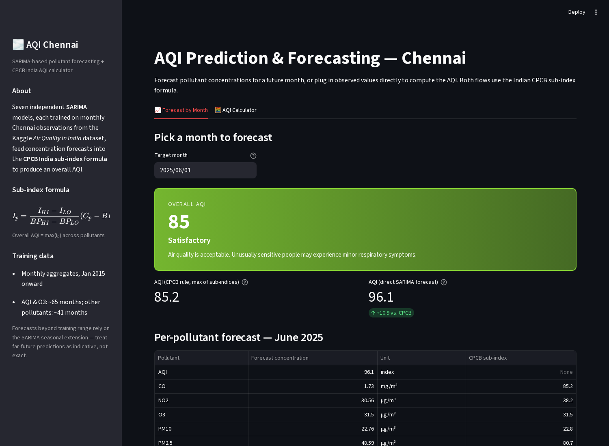
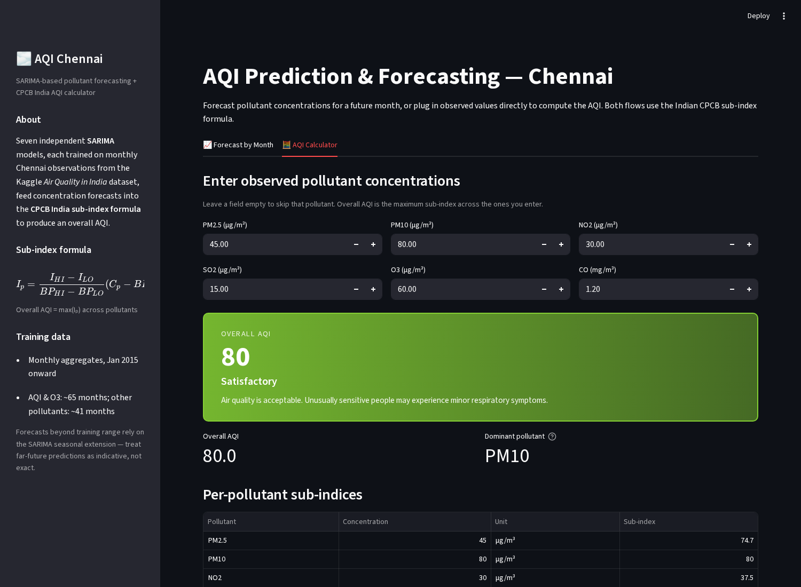

# AQI Prediction & Forecasting — Chennai

[](https://share.streamlit.io/)

A Streamlit web app that **forecasts monthly pollutant concentrations**
for Chennai using seven independent SARIMA models and converts them
into an overall Air Quality Index via the **Indian CPCB sub-index
formula**. An AQI calculator tab also lets you plug in observed values
directly.



## Features

- **Forecast by month** — date picker → each of the six pollutant
  SARIMA models predicts a concentration → CPCB sub-index → overall
  AQI = max of sub-indices. A standalone AQI SARIMA model is shown
  alongside as a cross-check.
- **AQI calculator** — enter observed concentrations for PM2.5, PM10,
  NO2, SO2, O3, and CO; the overall AQI and dominant pollutant are
  computed live as you type.
- **Colour-coded severity banner** using the six CPCB categories
  (Good, Satisfactory, Moderately polluted, Poor, Very poor, Severe)
  with accompanying health advice.
- **CSV export** of the per-month forecast.
- **Expandable reference table** of the full CPCB breakpoint grid.

## CPCB India sub-index formula

```
       I_HI − I_LO
I_p = ─────────────── · (C_p − BP_LO) + I_LO
       BP_HI − BP_LO

Overall AQI = max(I_p)  across pollutants
```

Each pollutant has six concentration bands; the band containing the
measurement supplies `BP_LO, BP_HI, I_LO, I_HI`, and the sub-index is
a simple linear interpolation. The worst single sub-index sets the
overall AQI — so the *dominant pollutant* readout tells you which
component is actually driving the score.

## Screenshots

### Forecast by Month


### AQI Calculator


## Models

Seven SARIMA models, one per pollutant, each pickled in `models/`:

| Model | Target | Training range | Observations |
|-------|--------|----------------|--------------|
| `aqi.pkl`  | Overall AQI              | Jan 2015 – May 2020 | 65 monthly |
| `o3.pkl`   | O₃ (ozone)               | Jan 2015 – May 2020 | 65 monthly |
| `pm25.pkl` | PM2.5                    | Jan 2015 – May 2018 | 41 monthly |
| `pm10.pkl` | PM10                     | Jan 2015 – May 2018 | 41 monthly |
| `no2.pkl`  | NO₂                      | Jan 2015 – May 2018 | 41 monthly |
| `so2.pkl`  | SO₂                      | Jan 2015 – May 2018 | 41 monthly |
| `co.pkl`   | CO                       | Jan 2015 – May 2018 | 41 monthly |

Training notebooks in `notebooks/training/` show the fit procedure
(ADF stationarity check → SARIMA order selection → cross-validation).

> Forecasts far beyond the training range rely on the SARIMA seasonal
> extension — treat long-horizon predictions as indicative, not exact.

## Run locally

```bash
pip install -r requirements.txt
streamlit run app.py
```

Opens in your browser at <http://localhost:8501>.

## Deploy to Streamlit Community Cloud

This repo is ready to deploy on [share.streamlit.io](https://share.streamlit.io):

1. Sign in with GitHub.
2. Click **New app** → pick `NishanthSundaran/AQI_prediction`.
3. Branch: `main`, main file path: `app.py`, Python version: `3.11`.
4. Click **Deploy**. First boot takes ~2 minutes (pip install + model load).

Pinned dependencies in `requirements.txt` keep the pickled SARIMAX
models compatible with the cloud runtime; the theme in
`.streamlit/config.toml` is applied automatically.

## Repo layout

```
.
├── app.py                          # Streamlit app (forecast + calculator)
├── requirements.txt
├── models/                         # pickled SARIMA models (one per pollutant)
│   ├── aqi.pkl
│   ├── co.pkl  no2.pkl  o3.pkl
│   └── pm10.pkl  pm25.pkl  so2.pkl
├── data/                           # Kaggle "Air Quality in India" CSVs
│   ├── city_day.csv
│   ├── station_day.csv
│   └── stations.csv
├── notebooks/
│   ├── training/                   # one fit notebook per pollutant
│   │   ├── aqi_chennai.ipynb
│   │   ├── co.ipynb  no2.ipynb  o3.ipynb
│   │   └── pm10.ipynb  pm25.ipynb  so2.ipynb
│   └── legacy_gui/                 # original Tkinter GUI (kept for reference)
│       ├── GUI1_mixed.ipynb
│       ├── GUI_AQI_calculator_India_standards.ipynb
│       └── GUI_AQI_calculator_USA_standards.ipynb
└── docs/
    └── images/                     # screenshots used in this README
```

The previous interface was a bare-bones Tkinter window (see
`notebooks/legacy_gui/`). This Streamlit rewrite keeps the same
underlying SARIMA models and CPCB math, but ships a colour-coded
severity banner, per-pollutant sub-index table, live updates on the
calculator tab, CSV export, and a reference breakpoint table — none
of which fit cleanly into the original Tkinter layout.

## Data source

Kaggle — **Air Quality Data in India (2015 – 2020)**, CPCB (Central
Pollution Control Board) station observations. Only the Chennai
subset is used; stations aggregated to monthly means before fitting.

## License

Apache-2.0.
